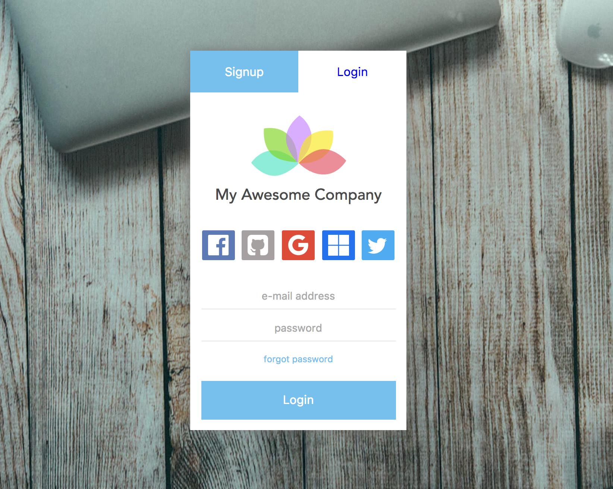

# auth-component

[](https://travis-ci.org/icanjs/auth-component)

Simple authentication utilities for DoneJS

Find docs for the old version here: https://github.com/marshallswain/auth-component



## Usage


## OAuth Providers
The default OAuth provider URLs are based on the `base-url` attribute and match the ones setup by FeathersJS' excellent [feathers-authentication](http://github.com/feathersjs/feathers-authentication) plugin.  Without a `base-url`, they are relative to the current host (domain + port). 

```html
<!-- Example default GitHub URL with base-url attribute set to `http://localhost:3030` -->
<a href="http://localhost:3030/auth/github">Login with GitHub</a>
```

You can customize the URL for any provider by using the `<providername>-url` attribute.  In the following example, the `github-url` attribute is used to override the default one.

```html
<!-- Change the GitHub button's URL. -->
<auth-component base-url="http://localhost:3030" github-url="https://my-custom-auth-page.com/github"></auth-component>
```

If any provider URL contains a `://` it will be considered an absolute URL.  Without the `://` it will be appended (relative) to the current host.

### ES6 use

With StealJS, you can import this module directly in a template that is autorendered:

```js
import plugin from 'auth-component';
```

### CommonJS use

Use `require` to load `auth-component` and everything else
needed to create a template that uses `auth-component`:

```js
var plugin = require("auth-component");
```

## AMD use

Configure the `can` and `jquery` paths and the `auth-component` package:

```html
<script src="require.js"></script>
<script>
	require.config({
	    paths: {
	        "jquery": "node_modules/jquery/dist/jquery",
	        "can": "node_modules/canjs/dist/amd/can"
	    },
	    packages: [{
		    	name: 'auth-component',
		    	location: 'node_modules/auth-component/dist/amd',
		    	main: 'lib/auth-component'
	    }]
	});
	require(["main-amd"], function(){});
</script>
```

### Standalone use

Load the `global` version of the plugin:

```html
<script src='./node_modules/auth-component/dist/global/auth-component.js'></script>
```

## Contributing

### Making a Build

To make a build of the distributables into `dist/` in the cloned repository run

```
npm install
node build
```

### Running the tests

Tests can run in the browser by opening a webserver and visiting the `test.html` page.
Automated tests that run the tests from the command line in Firefox can be run with

```
npm test
```
